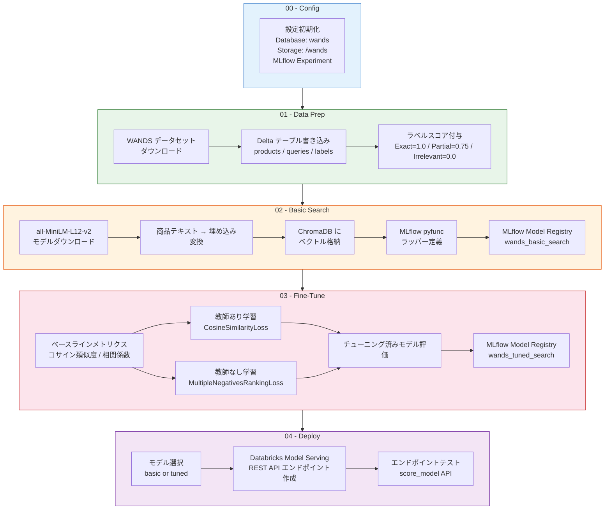
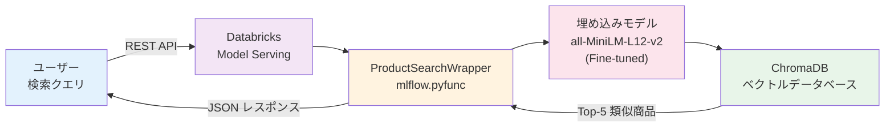

[](https://cloud.google.com/databricks)
[](https://databricks.com/try-databricks)

# LLM 製品検索アクセラレーター — 埋め込みモデルファインチューニング

大規模言語モデル（LLM）を活用したセマンティック商品検索システムを構築するための Databricks ソリューションアクセラレーターです。キーワードマッチングではなく、**単語の概念的な類似性**に基づく検索を実現し、さらに埋め込みモデルのファインチューニングによりドメイン固有の検索精度を向上させます。

---

## 目次

- [参照情報の要約](#参照情報の要約)
- [アーキテクチャ](#アーキテクチャ)
- [ノートブック構成](#ノートブック構成)
- [セットアップ手順](#セットアップ手順)
- [デバッグ・トラブルシューティング Tips](#デバッグトラブルシューティング-tips)
- [参照文献](#参照文献)
- [ライセンス](#ライセンス)

---

## 参照情報の要約

### 1. 埋め込みモデルのファインチューニング概要（Zenn 記事より）

埋め込みモデルは、テキストを数値ベクトルに変換し、意味的な類似性に基づく検索を可能にする技術です。ファインチューニングが必要な理由は以下の通りです：

- **ドメイン特化**: 特定分野の専門用語や言語ニュアンスへの対応
- **新規タスク・言語への応用**: 事前学習に含まれなかった領域への適用

ファインチューニングには **3 要素**が必要です：

| 要素 | 説明 | 例 |
|------|------|-----|
| クエリ | 質問や検索ワード | `"kid-proof rug"` |
| コーパス | 回答文や検索対象テキスト | 商品説明文 |
| スコア | 関連性ラベル | Exact=1.0, Partial=0.75, Irrelevant=0.0 |

**2 つの学習アプローチ:**

- **教師あり学習（Supervised）**: `CosineSimilarityLoss` — スコアデータを使い、モデル出力のコサイン類似度と正解ラベルを比較して最適化
- **教師なし学習（Unsupervised）**: `MultipleNegativesRankingLoss` — スコアなしで、正のペアを近づけ負のペアを遠ざける

### 2. 検索と RAG の改善（Databricks ブログより）

ドメイン固有データでの埋め込みモデルファインチューニングにより、ベクトル検索と RAG の精度が大幅に向上します：

- **検索精度の向上**: カスタム埋め込みによる検索結果の改善（FinanceBench で Recall@10 が 0.293 → 0.552、88% 向上）
- **RAG パフォーマンスの強化**: ハルシネーション削減と根拠ある回答の生成
- **コスト効率化**: 小規模ファインチューニング済みモデルが大規模モデルを上回るケースあり

**ベストプラクティス:**

- ファインチューニングは **検索が明確なボトルネック** である場合に最も効果的
- **ハイブリッド検索**（密な埋め込み + キーワード検索）の併用を検討
- **リランカー** による結果の再順序付けも有効
- **ハードネガティブ** の活用でさらなる精度向上が期待できる
- 合成トレーニングデータの生成には LLM（Llama 3 405B 等）が利用可能

---

## アーキテクチャ

### パイプライン全体像



### 推論アーキテクチャ



### 技術スタック

| コンポーネント | 技術 | バージョン |
|---|---|---|
| 埋め込みモデル | `all-MiniLM-L12-v2` (sentence-transformers) | 2.7.0 |
| ベクトルストア | ChromaDB | 0.4.24 |
| オーケストレーション | LangChain Community + Chroma + HuggingFace | 0.2.16 |
| モデル管理 | MLflow | (Databricks 組み込み) |
| モデルサービング | Databricks Model Serving | REST API |
| データ基盤 | Delta Lake on Databricks | Spark 14.3.x GPU ML |
| データセット | WANDS (Wayfair) | 42K 商品, 233K ラベル |

---

## ノートブック構成

| # | ノートブック | 概要 |
|---|---|---|
| 00 | `00_Intro_and_Config.py` | 設定変数の初期化（DB名、パス、モデル名、トークン、MLflow実験） |
| 01 | `01_Data_Prep.py` | WANDS データセットのダウンロード → Delta テーブル化 → ラベルスコア付与 |
| 02 | `02_Define_Basic_Search.py` | ベースラインモデルの構築（埋め込み生成 → ChromaDB → MLflow 登録） |
| 03 | `03_Fine_Tune_Model.py` | 教師あり/教師なし学習によるファインチューニング → 評価 → MLflow 登録 |
| 04 | `04_Deploy_Model.py` | Databricks Model Serving へのデプロイ → REST API テスト |
| -- | `RUNME.py` | Workflow ジョブの自動作成・実行オーケストレーター |

---

## セットアップ手順

### 前提条件

- GPU 対応クラスタが利用可能な Databricks ワークスペース
- Databricks Runtime: **14.3.x GPU ML** 以上
- 推奨インスタンス: `g5.8xlarge` (AWS) / `Standard_NC12s_v3` (Azure)
- シングルノードクラスタで動作可能

### 実行方法

1. Databricks Repos でこのリポジトリをクローン
2. `RUNME` ノートブックを任意のクラスタにアタッチして Run-All
3. 自動作成されたマルチステップジョブを実行

### Databricks ワークスペースへの手動インポート

ノートブックは以下のパスにインポート済みです：

```
/Workspace/Users/yusuke.tsuchiya@databricks.com/product-search/
├── 00_Intro_and_Config
├── 01_Data_Prep
├── 02_Define_Basic_Search
├── 03_Fine_Tune_Model
├── 04_Deploy_Model
├── RUNME
└── util/
    └── create-update-serving-endpoint
```

---

## デバッグ・トラブルシューティング Tips

### クラスタ関連

| 症状 | 原因 | 解決策 |
|------|------|--------|
| `CUDA out of memory` | GPU メモリ不足 | より大きなインスタンスタイプにスケールアップ（例: `g5.8xlarge` → `g5.16xlarge`） |
| `RuntimeError: No CUDA GPUs are available` | CPU クラスタを使用している | GPU ML Runtime（`12.2.x-gpu-ml-scala2.12`）を選択したクラスタに変更 |
| ノートブック実行がタイムアウト | 処理時間超過 | `RUNME.py` の `timeout_seconds`（デフォルト 28800 = 8h）を調整 |

### データ準備関連

| 症状 | 原因 | 解決策 |
|------|------|--------|
| `FileNotFoundException` (WANDS ダウンロード) | ネットワーク制限または GitHub API 制限 | DBFS に手動アップロードするか、プロキシ設定を確認 |
| `AnalysisException: Table 'products' not found` | `01_Data_Prep` が未実行 | ノートブックを順番通り（00→01→02→03→04）に実行 |
| `label_score` カラムが NULL | ラベル値が想定外 | `labels` テーブルの `label` カラムの値を確認（Exact/Partial/Irrelevant） |

### モデル・埋め込み関連

| 症状 | 原因 | 解決策 |
|------|------|--------|
| `OSError: Can't load tokenizer for 'all-MiniLM-L12-v2'` | HuggingFace Hub へのアクセス不可 | プロキシ設定またはオフラインモードを確認。事前にモデルをダウンロードして DBFS に配置 |
| コサイン類似度が改善しない | エポック数が少ない / データ品質の問題 | `epochs` を 2-5 に増やす。教師なし学習は特に複数エポックが必要 |
| `chromadb.errors.InvalidCollectionException` | ChromaDB バージョン不整合 | `%pip install chromadb==0.4.24` でバージョンを固定 |

### ファインチューニング関連

| 症状 | 原因 | 解決策 |
|------|------|--------|
| 教師なし学習で精度が下がる | 1 エポックでは不十分 | `epochs` を 3-5 に増やして再実行 |
| `ValueError: Expected label` | `InputExample` に `label` パラメータが不足 | 教師あり学習では `InputExample(texts=[...], label=score)` と明示的に指定 |
| 学習が収束しない | 学習率やバッチサイズが不適切 | `batch_size` を 16-32、`warmup_steps` を 100-200 の範囲で調整 |

### デプロイ関連

| 症状 | 原因 | 解決策 |
|------|------|--------|
| `403 Forbidden` (Model Serving) | トークンの権限不足 | `DATABRICKS_TOKEN` を再設定。PAT に `Can Manage` 権限があることを確認 |
| エンドポイントが `NOT_READY` のまま | モデルのロードに時間がかかっている | 数分待つ。`wait_for_endpoint()` は 30 秒間隔でポーリング |
| `Request failed with status 400` | 入力データのフォーマット不正 | `pd.DataFrame({'query': ['検索語']})` の形式で送信しているか確認 |
| エンドポイントが見つからない | エンドポイント名の不一致 | `config['serving_endpoint_name']`（デフォルト: `wands_search`）を確認 |

### パフォーマンスチューニング

```
推奨パラメータ設定:
┌─────────────────────┬────────────────┬─────────────────────────────┐
│ パラメータ            │ 推奨値         │ 説明                         │
├─────────────────────┼────────────────┼─────────────────────────────┤
│ batch_size          │ 16-32          │ GPU メモリに応じて調整         │
│ epochs (教師あり)    │ 1-3            │ 1 エポックでも十分な改善あり    │
│ epochs (教師なし)    │ 3-5            │ 複数エポック推奨               │
│ warmup_steps        │ 100-200        │ 学習率スケジューリング用       │
│ max_results (検索)   │ 5-10           │ Top-K 検索結果数              │
│ scale_to_zero       │ True           │ コスト最適化（起動に時間要）    │
└─────────────────────┴────────────────┴─────────────────────────────┘
```

### 評価メトリクスの読み方

- **コサイン類似度（平均値）**: 0.0-1.0 の範囲。1.0 に近いほどクエリと商品の埋め込みが近い。ファインチューニングで値が上昇すれば改善
- **相関係数**: 正解ラベルスコアとコサイン類似度の相関。高いほどモデルが人間の判断に近い関連性を学習している
- **Recall@K**: 上位 K 件に正解文書が含まれる割合。検索システム全体の品質指標

---

## 参照文献

1. **Databricks での埋め込みモデルファインチューニング**
   - URL: https://zenn.dev/hiouchiy/articles/e608379945ec47
   - 内容: sentence-transformers を使った教師あり/教師なし学習の実装手順、Databricks 上での環境構築

2. **Improving Retrieval and RAG with Embedding Model Finetuning**
   - URL: https://www.databricks.com/jp/blog/improving-retrieval-and-rag-embedding-model-finetuning
   - 内容: RAG における埋め込みモデルの重要性、合成データ生成、評価方法（Recall@10）、ベストプラクティス

3. **WANDS: Wayfair Annotation Dataset**
   - URL: https://github.com/wayfair/WANDS
   - 内容: 42,000+ 商品、480 クエリ、233,000+ ラベル付きデータセット（MIT ライセンス）

4. **sentence-transformers ドキュメント**
   - URL: https://www.sbert.net/
   - 内容: 埋め込みモデルの学習・推論ライブラリ

5. **all-MiniLM-L12-v2 モデルカード**
   - URL: https://huggingface.co/sentence-transformers/all-MiniLM-L12-v2
   - 内容: 本アクセラレーターで使用するベース埋め込みモデル

6. **Databricks Model Serving ドキュメント**
   - URL: https://docs.databricks.com/machine-learning/model-serving/index.html
   - 内容: モデルのリアルタイムサービング設定

7. **MLflow ドキュメント**
   - URL: https://mlflow.org/docs/latest/index.html
   - 内容: モデル管理・レジストリ・デプロイメント

8. **ChromaDB ドキュメント**
   - URL: https://docs.trychroma.com/
   - 内容: 軽量ベクトルデータベース

9. **LangChain ドキュメント**
   - URL: https://python.langchain.com/
   - 内容: LLM アプリケーション構築フレームワーク

---

## ライセンス

&copy; 2023 Databricks, Inc. All rights reserved. The source in this notebook is provided subject to the [Databricks License](https://databricks.com/db-license-source).

| ライブラリ | 説明 | ライセンス | ソース |
|---|---|---|---|
| WANDS | Wayfair 商品検索関連性データ | MIT | https://github.com/wayfair/WANDS |
| LangChain | LLM アプリケーション構築 | MIT | https://pypi.org/project/langchain/ |
| ChromaDB | オープンソース埋め込みデータベース | Apache | https://pypi.org/project/chromadb/ |
| sentence-transformers | 文・段落のベクトル表現計算 | Apache 2.0 | https://pypi.org/project/sentence-transformers/ |
